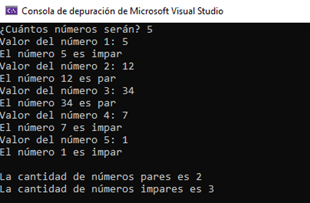

# Números-Validados-Par-o-Impar
El siguiente programa recibe una cantidad N de números y determina si cada uno es par o impar 

### Instrucciones
Realiza el análisis, diseño e implementación de un programa que:
+ Lea un número entero N, que representa la cantidad de números enteros a pedir.
+ Para cada número indique si el número es par o impar .
+ Al final debe de indicar cuántos números fueron pares y cuántos fueron impares.

### Tecnologías utilizadas
+ **Microsof Visual Studio:** Para desarrollar el código del programa.

### El programa deberá presentar una pantalla similar a la siguiente después de compilarse

